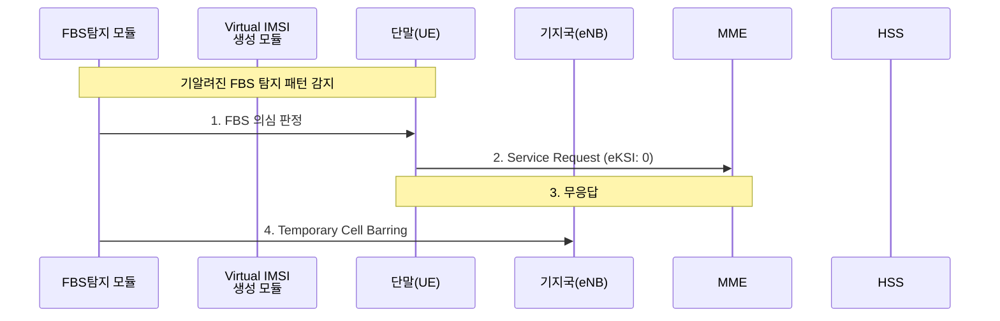
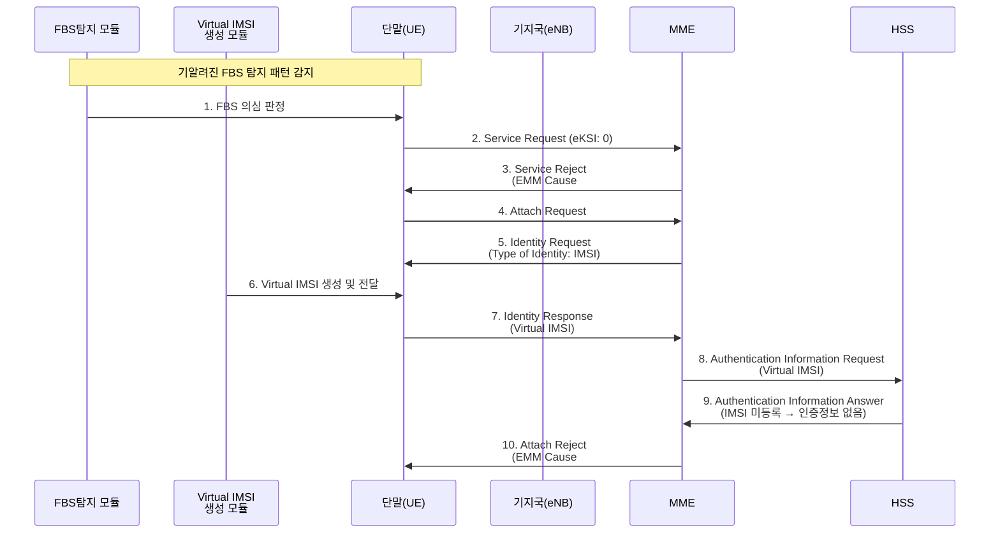

**[2-1] FBS 판단 - 무응답 케이스**

```mermaid
sequenceDiagram
    participant FBS as FBS탐지 모듈
    participant VIMSI as Virtual IMSI<br/>생성 모듈
    participant UE as 단말(UE)
    participant eNB as 기지국(eNB)
    participant MME as MME
    participant HSS as HSS

    Note over FBS,UE: 기알려진 FBS 탐지 패턴 감지
    FBS->>UE: 1. FBS 의심 판정
    UE->>MME: 2. Service Request (eKSI: 0)
    Note over MME,UE: 3. 무응답
    FBS->>eNB: 4. Temporary Cell Barring
```

---

**[2-2] FBS 판단 - Service Reject 케이스**

```mermaid
sequenceDiagram
    participant FBS as FBS탐지 모듈
    participant VIMSI as Virtual IMSI<br/>생성 모듈
    participant UE as 단말(UE)
    participant eNB as 기지국(eNB)
    participant MME as MME
    participant HSS as HSS

    Note over FBS,UE: 기알려진 FBS 탐지 패턴 감지
    FBS->>UE: 1. FBS 의심 판정
    UE->>MME: 2. Service Request (eKSI: 0)
    MME->>UE: 3. Service Reject<br/>(EMM Cause #9 또는 #10)
    UE->>MME: 4. Attach Request
    MME->>UE: 5. Identity Request<br/>(Type of Identity: IMSI)
    VIMSI->>UE: 6. Virtual IMSI 생성 및 전달
    UE->>MME: 7. Identity Response<br/>(Virtual IMSI)
    MME->>HSS: 8. Authentication Information Request<br/>(Virtual IMSI)
    HSS->>MME: 9. Authentication Information Answer<br/>(IMSI 미등록 → 인증정보 없음)
    MME->>UE: 10. Attach Reject<br/>(EMM Cause #2 또는 #8)
```

총 3개 독립 다이어그램으로 정리됐어요! 추가 수정 있으면 말씀해주세요 😊
