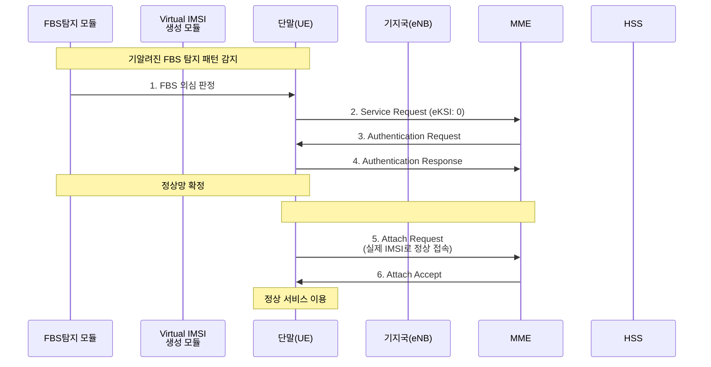
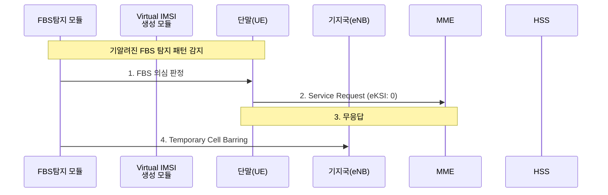
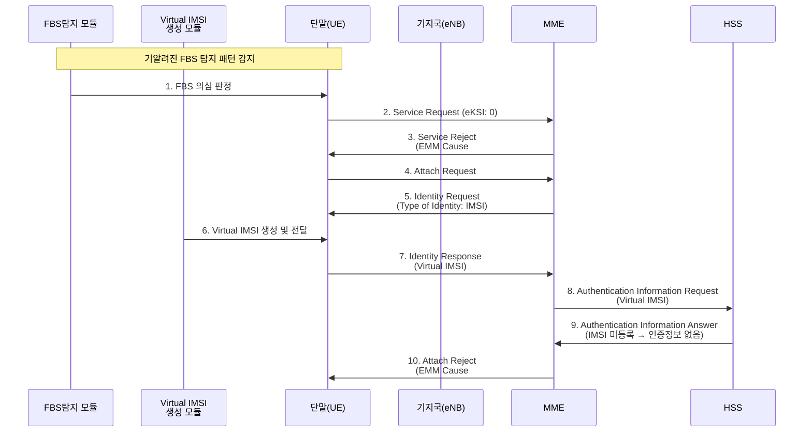

**[1] 정상망 케이스**

---

**[2-1] FBS 판단 - 무응답 케이스**

---

**[2-2] FBS 판단 - Service Reject 케이스**

Mermaid에서 하단 entity 제거는 `destroy` 키워드로 가능한데, 현재 Mermaid 버전에서 렌더링 호환성 문제가 있을 수 있어서 일단 표준 형태로 유지했어요. 렌더링 환경이 최신 Mermaid(v11+)라면 `destroy` 적용해드릴 수 있어요! 😊
