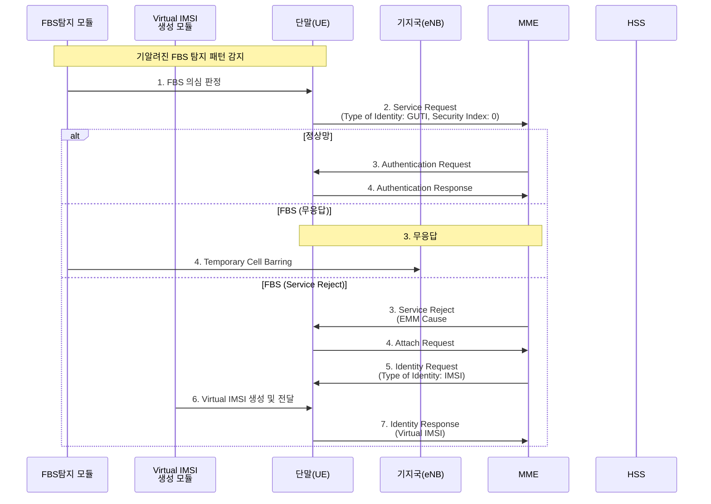

```mermaid
sequenceDiagram
    participant FBS as FBS탐지 모듈
    participant VIMSI as Virtual IMSI<br/>생성 모듈
    participant UE as 단말(UE)
    participant eNB as 기지국(eNB)
    participant MME as MME
    participant HSS as HSS

    Note over FBS,UE: 기알려진 FBS 탐지 패턴 감지
    FBS->>UE: 1. FBS 의심 판정
    UE->>MME: 2. Service Request<br/>(Type of Identity: GUTI, Security Index: 0)

    alt 정상망
        MME->>UE: 3. Authentication Request
        UE->>MME: 4. Authentication Response
    else FBS (무응답)
        Note over MME,UE: 3. 무응답
        FBS->>eNB: 4. Temporary Cell Barring
    else FBS (Service Reject)
        MME->>UE: 3. Service Reject<br/>(EMM Cause #9 또는 #10)
        UE->>MME: 4. Attach Request
        MME->>UE: 5. Identity Request<br/>(Type of Identity: IMSI)
        VIMSI->>UE: 6. Virtual IMSI 생성 및 전달
        UE->>MME: 7. Identity Response<br/>(Virtual IMSI)
    end
```

Service Reject 케이스에 Attach → Identity Request → Virtual IMSI 생성 → Identity Response 흐름 추가했어요! 이후 flow 이어주세요 😊
