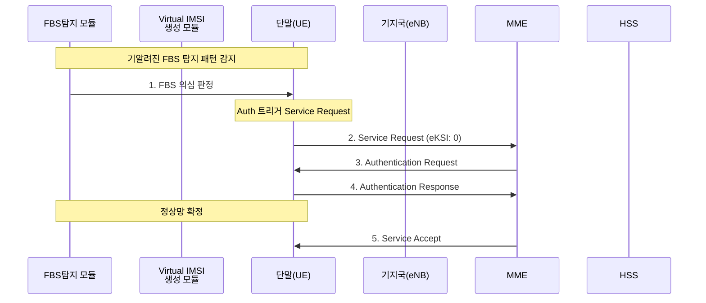
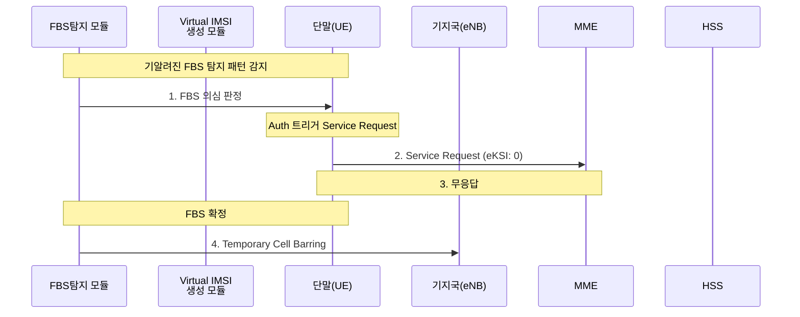
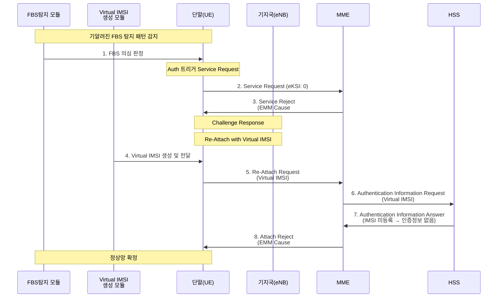
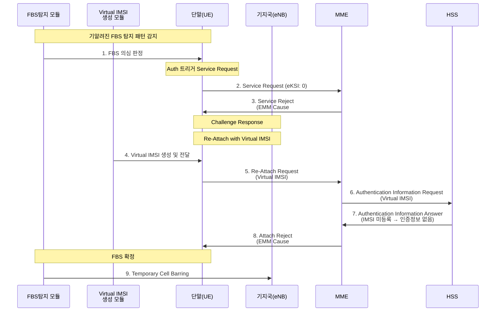

**[1] 정상망 케이스**

---

**[2] FBS 판단 - 무응답 케이스**

---

**[3] FBS 판단 - Service Reject 케이스 (정상망)**

---

**[4] FBS 판단 - Service Reject 케이스 (FBS)**

3번은 정상망 확정, 4번은 FBS 확정 후 Temporary Cell Barring으로 마무리했어요! 추가 수정 있으면 말씀해주세요 😊
