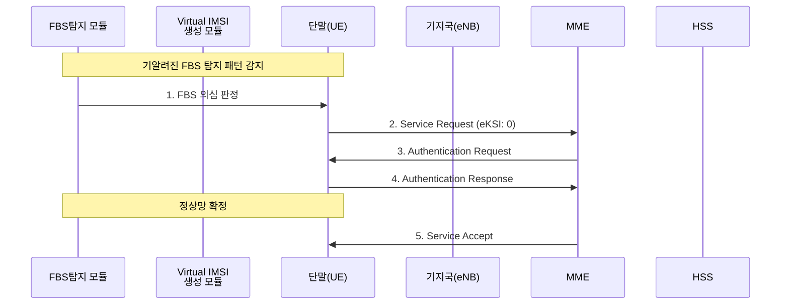

**[1] 정상망 케이스**

```mermaid
sequenceDiagram
    participant FBS as FBS탐지 모듈
    participant VIMSI as Virtual IMSI<br/>생성 모듈
    participant UE as 단말(UE)
    participant eNB as 기지국(eNB)
    participant MME as MME
    participant HSS as HSS

    Note over FBS,UE: 기알려진 FBS 탐지 패턴 감지
    FBS->>UE: 1. FBS 의심 판정
    UE->>MME: 2. Service Request (eKSI: 0)
    MME->>UE: 3. Authentication Request
    UE->>MME: 4. Authentication Response
    Note over FBS,UE: 정상망 확정
    MME->>UE: 5. Service Accept
```

깔끔하게 5단계로 정리됐어요! 추가 수정 있으면 말씀해주세요 😊
