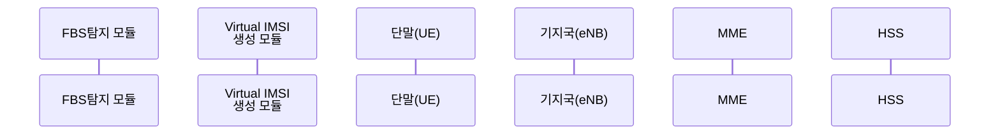

알겠어요! 일단 기본 entity 구조부터 잡아놓을게요.

일단 기본 틀부터 바로 만들어 드릴게요!

```mermaid
sequenceDiagram
    autonumber
    participant FBS as FBS탐지 모듈
    participant VIMSI as Virtual IMSI<br/>생성 모듈
    participant UE as 단말(UE)
    participant eNB as 기지국(eNB)
    participant MME as MME
    participant HSS as HSS
```

entity 6개 순서대로 좌→우 배치했어요. 이제 각 상황 설명해주시면 flow 계속 추가해드릴게요! 🙌
